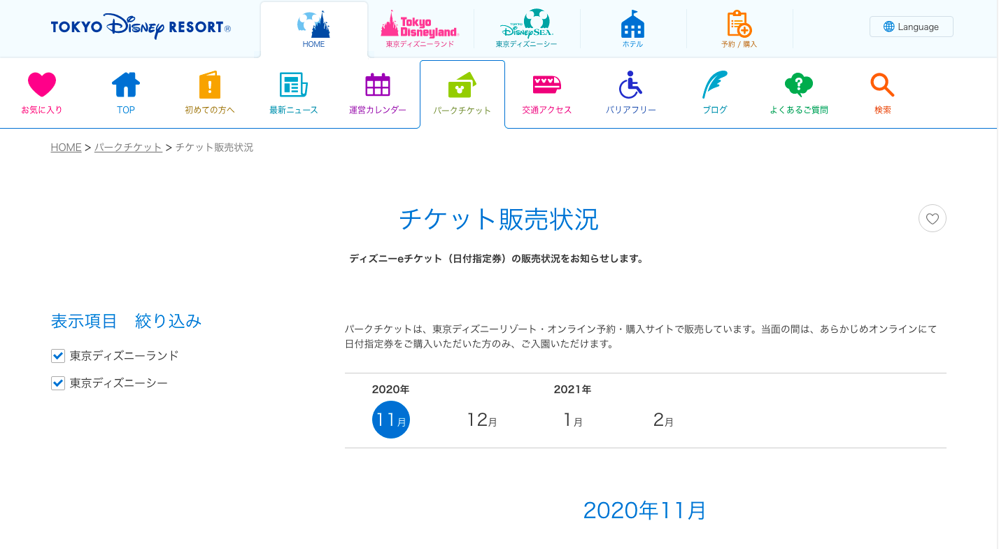
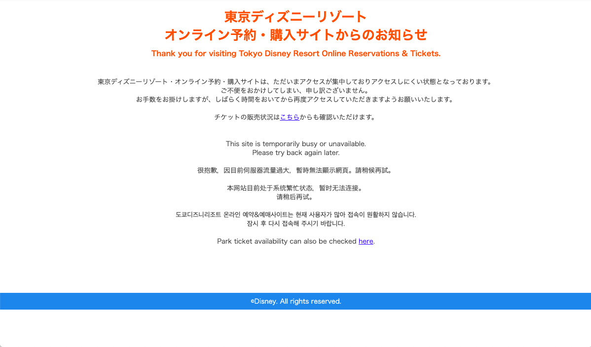
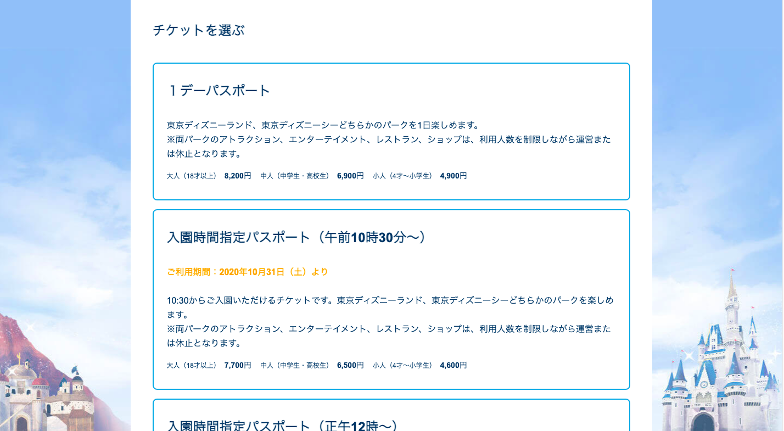

# Let's go to Tokyo Disney Resort

予約が非常に困難な東京ディズニーリゾートの予約を自動化します。<br>
信じていれば夢は叶う、とシンデレラは言いました。<br>
このアプリを起動し、信じて（放置して）いればチケットが取れます。<br>
さあ、夢の国へ！<br>


## Abstract
パークチケットの購入手順は、<br>
日付指定→チケット指定→個人情報入力orログイン<br>
という手順で進みます。<br>

現在東京ディズニーリゾートは完全予約制となっており、1ヶ月先の1週間分のチケットを、各水曜日の14時から予約できるような仕組みとなっております(2021年11月現在)。<br>
水曜日の14時以降、日付指定画面からチケット指定画面に進もうとすると、高確率でアクセス集中画面へリダイレクトされてしまい、なかなか予約へ進むことができません。<br>
そこで、チケット指定画面にアクセスできるまで、Google Chromeを自動制御するソフトウェアを作成しました。


## Preparation
Google Chromeをインストールしていない場合、[ここ](https://www.google.com/intl/ja/chrome/)からインストールして下さい。<br>
また、以下のパッケージを使用します。インストールしていない場合は以下のコマンドでインストールして下さい。
```
$ pip install selenium
$ pip install chromedriver-binary==[Version of Your Chrome Driver]
```
Chrome Driverのバージョンは、自身が使っているChromeのバージョンに合わせてください。<br>
Chrome Driverのバージョン一覧は[こちら](https://chromedriver.chromium.org/downloads)<br>
Google Chromeのバージョン確認方法は[こちら](https://pc-karuma.net/google-chrome-version-update/)<br>

続いて、このリポジトリを好きなディレクトリでクローンします。
```
$ git clone https://github.com/Tiger-0512/get-dream.git
```


## Get Dream!
ディレクトリに入って実行します。
```
$ cd get-dream
$ python run.py
```
実行すると、コマンドライン上に指示が出ます。<br>
たとえば9月4日のディズニーシーのチケットを取りたい場合、以下のように入力してエンターを押します。

```
予約したい月、日、パーク(tdlまたはtds)を1つずつスペースを挟み、入力してください。正しい入力が与えられると予約の空きがあるかチェックします。
09 04 tds
```

従っていけばあら簡単！チケットが取れます。


## Notice
`module.py`内、７７行目のsleepの値は、自然にアクセスが可能な値に留めてください（初期設定では、３秒毎にアクセスを行うよう設定しています）。<br>
この値を小さくしすぎると、サーバに非常に大きな負荷がかかってしまいます。


## Reference Image
日付指定画面

<br>
アクセス集中画面

<br>
チケット指定画面

